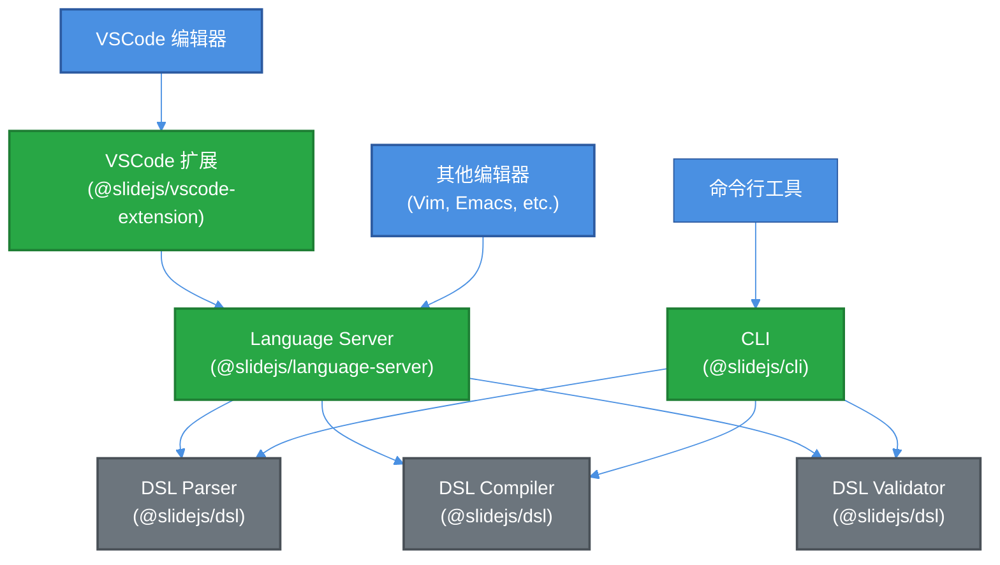

# RFC 0013: Slide DSL 语言服务器与开发工具

## 元数据
- **RFC ID**: 0013
- **标题**: Slide DSL 语言服务器、VSCode 语法高亮与 CLI 工具
- **状态**: 草稿
- **创建日期**: 2025-12-26
- **作者**: Claude Code
- **相关 RFC**: RFC 0010 (Slide DSL), RFC 0011 (Slide Runner)

## 摘要

本 RFC 定义了为 Slide DSL 提供开发工具支持的设计方案，包括：
1. **Language Server Protocol (LSP)** 实现，提供代码补全、错误诊断、跳转定义等功能
2. **VSCode 扩展**，提供语法高亮、代码片段、错误提示等
3. **CLI 工具**，用于编译、验证和格式化 Slide DSL 文件

这些工具将显著提升 Slide DSL 的开发体验，使开发者能够更高效地编写和维护 Slide DSL 代码。

## 动机

### 背景问题

1. **缺乏 IDE 支持**：当前 Slide DSL 在编辑器中没有任何语法高亮、错误提示或代码补全
2. **调试困难**：编写 DSL 时无法实时验证语法和语义错误
3. **学习曲线陡峭**：新用户需要查阅文档才能了解可用的语法和选项
4. **缺乏工具链**：没有命令行工具来验证、格式化或转换 DSL 文件

### 设计目标

1. **完整的 IDE 支持**：提供语法高亮、代码补全、错误诊断、跳转定义等
2. **实时验证**：在编辑时即时显示语法和语义错误
3. **开发体验优化**：提供代码片段、格式化、文档提示等
4. **命令行工具**：提供 CLI 用于编译、验证、格式化 DSL 文件
5. **标准化**：使用 LSP 标准，支持所有支持 LSP 的编辑器

## 详细设计

### 1. 架构概览



### 2. 包结构

#### 2.1 @slidejs/language-server

**职责**：实现 Language Server Protocol (LSP)，提供核心语言服务功能

**功能**：
- 语法解析和 AST 生成
- 错误诊断（语法错误、语义错误）
- 代码补全（关键字、属性、值建议）
- 跳转定义（查找规则、变量定义）
- 悬停提示（显示文档和类型信息）
- 代码格式化
- 符号搜索

**包结构**：
```
packages/@slidejs/language-server/
├── src/
│   ├── server.ts           # LSP 服务器主入口
│   ├── documents.ts        # 文档管理
│   ├── diagnostics.ts      # 错误诊断
│   ├── completion.ts        # 代码补全
│   ├── hover.ts            # 悬停提示
│   ├── definition.ts       # 跳转定义
│   ├── formatting.ts       # 代码格式化
│   ├── symbols.ts          # 符号搜索
│   └── index.ts
├── package.json
├── tsconfig.json
└── vite.config.ts
```

**依赖**：
- `vscode-languageserver` - LSP 服务器实现
- `vscode-languageserver-textdocument` - 文档管理
- `@slidejs/dsl` - DSL 解析器和编译器
- `@slidejs/core` - 类型定义

#### 2.2 @slidejs/vscode-extension

**职责**：VSCode 扩展，提供语法高亮、代码片段、错误提示等

**功能**：
- 语法高亮（TextMate grammar）
- 代码片段（Snippets）
- 文件关联（`.slide` 文件）
- 语言服务器客户端连接
- 主题支持（亮色/暗色）

**包结构**：
```
packages/@slidejs/vscode-extension/
├── src/
│   ├── extension.ts        # 扩展主入口
│   ├── client.ts           # LSP 客户端
│   └── activationEvents.ts # 激活事件
├── syntaxes/
│   └── slide.tmLanguage.json  # TextMate 语法定义
├── snippets/
│   └── slide.code-snippets     # 代码片段
├── package.json
├── tsconfig.json
└── vite.config.ts
```

**依赖**：
- `vscode` - VSCode API
- `vscode-languageclient` - LSP 客户端
- `@slidejs/language-server` - 语言服务器

#### 2.3 @slidejs/cli

**职责**：命令行工具，用于编译、验证和格式化 Slide DSL 文件

**功能**：
- `compile` - 编译 DSL 文件为 JSON
- `validate` - 验证 DSL 文件语法和语义
- `format` - 格式化 DSL 文件
- `check` - 检查 DSL 文件错误
- `watch` - 监听文件变化并自动编译/验证

**包结构**：
```
packages/@slidejs/cli/
├── src/
│   ├── index.ts            # CLI 主入口
│   ├── commands/
│   │   ├── compile.ts      # 编译命令
│   │   ├── validate.ts     # 验证命令
│   │   ├── format.ts       # 格式化命令
│   │   ├── check.ts        # 检查命令
│   │   └── watch.ts        # 监听命令
│   ├── utils/
│   │   ├── file.ts         # 文件操作
│   │   └── output.ts       # 输出格式化
│   └── bin/
│       └── slidejs          # CLI 可执行文件
├── package.json
├── tsconfig.json
└── vite.config.ts
```

**依赖**：
- `commander` - 命令行参数解析
- `chalk` - 终端颜色输出
- `ora` - 加载动画
- `glob` - 文件匹配
- `chokidar` - 文件监听
- `@slidejs/dsl` - DSL 解析器和编译器
- `@slidejs/core` - 类型定义

### 3. Language Server 实现

#### 3.1 核心功能

**文档管理**：
```typescript
import { TextDocuments } from 'vscode-languageserver';
import { TextDocument } from 'vscode-languageserver-textdocument';

const documents = new TextDocuments(TextDocument);

// 监听文档变化
documents.onDidChangeContent((change) => {
  // 重新解析和验证
  validateDocument(change.document);
});
```

**错误诊断**：
```typescript
import { parseSlideDSL, compile } from '@slidejs/dsl';
import { Diagnostic, DiagnosticSeverity } from 'vscode-languageserver';

async function validateDocument(document: TextDocument): Promise<Diagnostic[]> {
  const diagnostics: Diagnostic[] = [];
  const source = document.getText();

  try {
    // 解析 DSL
    const ast = await parseSlideDSL(source);
    
    // 编译验证
    compile(ast);
  } catch (error) {
    if (error instanceof ParseError && error.location) {
      diagnostics.push({
        range: {
          start: {
            line: error.location.start.line - 1,
            character: error.location.start.column - 1,
          },
          end: {
            line: error.location.end.line - 1,
            character: error.location.end.column - 1,
          },
        },
        message: error.message,
        severity: DiagnosticSeverity.Error,
        source: 'slide-dsl',
      });
    }
  }

  return diagnostics;
}
```

**代码补全**：
```typescript
import { CompletionItem, CompletionItemKind } from 'vscode-languageserver';

function provideCompletion(
  document: TextDocument,
  position: Position
): CompletionItem[] {
  const completions: CompletionItem[] = [];
  const line = document.getText({
    start: { line: position.line, character: 0 },
    end: position,
  });

  // 关键字补全
  if (line.trim().endsWith('present')) {
    completions.push({
      label: 'quiz',
      kind: CompletionItemKind.Keyword,
      detail: 'Quiz data source type',
      documentation: 'Use quiz as the source type for quiz presentations',
    });
    completions.push({
      label: 'survey',
      kind: CompletionItemKind.Keyword,
      detail: 'Survey data source type',
    });
  }

  // 规则类型补全
  if (line.includes('rule')) {
    completions.push(
      {
        label: 'start',
        kind: CompletionItemKind.Keyword,
        detail: 'Start rule - required',
      },
      {
        label: 'content',
        kind: CompletionItemKind.Keyword,
        detail: 'Content rule - for data-driven slides',
      },
      {
        label: 'end',
        kind: CompletionItemKind.Keyword,
        detail: 'End rule - required',
      }
    );
  }

  // 过渡效果补全
  if (line.includes('transition')) {
    completions.push(
      { label: 'slide', kind: CompletionItemKind.Value },
      { label: 'fade', kind: CompletionItemKind.Value },
      { label: 'zoom', kind: CompletionItemKind.Value },
      { label: 'none', kind: CompletionItemKind.Value }
    );
  }

  return completions;
}
```

**悬停提示**：
```typescript
import { Hover } from 'vscode-languageserver';

function provideHover(
  document: TextDocument,
  position: Position
): Hover | null {
  const word = getWordAtPosition(document, position);

  // 关键字文档
  const keywordDocs: Record<string, string> = {
    present: 'Declares a presentation with a source type and name',
    rule: 'Defines a rule for generating slides (start, content, or end)',
    slide: 'Defines a single slide with content and behavior',
    content: 'Defines slide content (text or dynamic)',
    behavior: 'Defines slide behavior (transitions, etc.)',
    transition: 'Defines slide transition animation',
  };

  if (keywordDocs[word]) {
    return {
      contents: {
        kind: 'markdown',
        value: `**${word}**\n\n${keywordDocs[word]}`,
      },
    };
  }

  return null;
}
```

#### 3.2 LSP 服务器实现

```typescript
import {
  createConnection,
  TextDocuments,
  Diagnostic,
  CompletionItem,
  Hover,
  InitializeParams,
  InitializeResult,
  TextDocumentSyncKind,
} from 'vscode-languageserver/node';
import { TextDocument } from 'vscode-languageserver-textdocument';

// 创建 LSP 连接
const connection = createConnection();
const documents = new TextDocuments(TextDocument);

// 初始化
connection.onInitialize((params: InitializeParams): InitializeResult => {
  return {
    capabilities: {
      textDocumentSync: TextDocumentSyncKind.Incremental,
      completionProvider: {
        triggerCharacters: [' ', '{', ':', '"'],
      },
      hoverProvider: true,
      definitionProvider: true,
      documentFormattingProvider: true,
      documentSymbolProvider: true,
      diagnosticProvider: {
        interFileDependencies: false,
        workspaceDiagnostics: false,
      },
    },
  };
});

// 文档变化时验证
documents.onDidChangeContent((change) => {
  validateDocument(change.document);
});

// 代码补全
connection.onCompletion((params) => {
  const document = documents.get(params.textDocument.uri);
  if (!document) return null;
  return provideCompletion(document, params.position);
});

// 悬停提示
connection.onHover((params) => {
  const document = documents.get(params.textDocument.uri);
  if (!document) return null;
  return provideHover(document, params.position);
});

// 启动服务器
documents.listen(connection);
connection.listen();
```

### 4. VSCode 扩展实现

#### 4.1 扩展主入口

```typescript
import * as vscode from 'vscode';
import {
  LanguageClient,
  LanguageClientOptions,
  ServerOptions,
} from 'vscode-languageclient/node';

export function activate(context: vscode.ExtensionContext) {
  // 语言服务器选项
  const serverOptions: ServerOptions = {
    run: {
      command: 'node',
      args: [context.asAbsolutePath('path/to/language-server')],
    },
    debug: {
      command: 'node',
      args: ['--inspect', context.asAbsolutePath('path/to/language-server')],
    },
  };

  // 客户端选项
  const clientOptions: LanguageClientOptions = {
    documentSelector: [{ scheme: 'file', language: 'slide' }],
  };

  // 创建并启动客户端
  const client = new LanguageClient(
    'slideDSL',
    'Slide DSL Language Server',
    serverOptions,
    clientOptions
  );

  client.start();
  context.subscriptions.push(client);
}
```

#### 4.2 语法高亮（TextMate Grammar）

**文件**: `syntaxes/slide.tmLanguage.json`

```json
{
  "$schema": "https://raw.githubusercontent.com/martinring/tmlanguage/master/tmlanguage.json",
  "name": "Slide DSL",
  "patterns": [
    {
      "name": "keyword.control.slide",
      "match": "\\b(present|rule|slide|content|behavior|transition|for|in|if|else)\\b"
    },
    {
      "name": "keyword.operator.slide",
      "match": "\\{|\\}|\\[|\\]|:"
    },
    {
      "name": "string.quoted.double.slide",
      "match": "\"([^\"\\\\]|\\\\.)*\""
    },
    {
      "name": "constant.numeric.slide",
      "match": "\\b\\d+\\b"
    },
    {
      "name": "constant.language.boolean.slide",
      "match": "\\b(true|false)\\b"
    },
    {
      "name": "entity.name.type.slide",
      "match": "\\b(quiz|survey|form|assessment|start|content|end|text|dynamic|slide|fade|zoom|none)\\b"
    }
  ],
  "scopeName": "source.slide"
}
```

#### 4.3 代码片段

**文件**: `snippets/slide.code-snippets`

```json
{
  "Present Declaration": {
    "prefix": "present",
    "body": [
      "present ${1:quiz} \"${2:name}\" {",
      "  rules {",
      "    rule start \"${3:intro}\" {",
      "      slide {",
      "        content text {",
      "          \"${4:Welcome}\"",
      "        }",
      "      }",
      "    }",
      "    $0",
      "    rule end \"thanks\" {",
      "      slide {",
      "        content text {",
      "          \"Thank You!\"",
      "        }",
      "      }",
      "    }",
      "  }",
      "}"
    ],
    "description": "Create a new presentation"
  },
  "Rule Start": {
    "prefix": "rule-start",
    "body": [
      "rule start \"${1:name}\" {",
      "  slide {",
      "    content text {",
      "      \"${2:Content}\"",
      "    }",
      "  }",
      "}"
    ],
    "description": "Create a start rule"
  },
  "Rule Content": {
    "prefix": "rule-content",
    "body": [
      "rule content \"${1:name}\" {",
      "  for ${2:item} in ${3:context.items} {",
      "    slide {",
      "      content dynamic {",
      "        name: \"${4:component}\"",
      "        attrs {",
      "          ${5:key}: ${6:value}",
      "        }",
      "      }",
      "    }",
      "  }",
      "}"
    ],
    "description": "Create a content rule with loop"
  }
}
```

#### 4.4 package.json 配置

```json
{
  "name": "slide-dsl",
  "displayName": "Slide DSL",
  "description": "Language support for Slide DSL",
  "version": "0.1.0",
  "engines": {
    "vscode": "^1.80.0"
  },
  "categories": ["Programming Languages"],
  "contributes": {
    "languages": [
      {
        "id": "slide",
        "aliases": ["Slide DSL", "slide"],
        "extensions": [".slide"],
        "configuration": "./language-configuration.json"
      }
    ],
    "grammars": [
      {
        "language": "slide",
        "scopeName": "source.slide",
        "path": "./syntaxes/slide.tmLanguage.json"
      }
    ],
    "snippets": [
      {
        "language": "slide",
        "path": "./snippets/slide.code-snippets"
      }
    ]
  },
  "activationEvents": ["onLanguage:slide"]
}
```

### 5. CLI 工具实现

#### 5.1 CLI 命令结构

```typescript
import { Command } from 'commander';
import { compileCommand } from './commands/compile';
import { validateCommand } from './commands/validate';
import { formatCommand } from './commands/format';
import { checkCommand } from './commands/check';
import { watchCommand } from './commands/watch';

const program = new Command();

program
  .name('slidejs')
  .description('Slide DSL CLI tool')
  .version('0.1.0');

program
  .command('compile')
  .description('Compile Slide DSL file to JSON')
  .argument('<file>', 'DSL file to compile')
  .option('-o, --output <path>', 'Output file path')
  .option('-w, --watch', 'Watch for changes')
  .action(compileCommand);

program
  .command('validate')
  .description('Validate Slide DSL file')
  .argument('<file>', 'DSL file to validate')
  .option('--strict', 'Enable strict validation')
  .action(validateCommand);

program
  .command('format')
  .description('Format Slide DSL file')
  .argument('<file>', 'DSL file to format')
  .option('-w, --write', 'Write formatted content to file')
  .action(formatCommand);

program
  .command('check')
  .description('Check DSL file for errors')
  .argument('<file>', 'DSL file to check')
  .option('--json', 'Output as JSON')
  .action(checkCommand);

program
  .command('watch')
  .description('Watch DSL files and auto-compile/validate')
  .argument('<files...>', 'DSL files to watch')
  .option('-c, --compile', 'Auto-compile on change')
  .option('-v, --validate', 'Auto-validate on change')
  .action(watchCommand);

program.parse();
```

#### 5.2 编译命令实现

```typescript
import { parseSlideDSL, compile } from '@slidejs/dsl';
import { readFile, writeFile } from 'fs/promises';
import { resolve } from 'path';
import chalk from 'chalk';
import ora from 'ora';

export async function compileCommand(
  file: string,
  options: { output?: string; watch?: boolean }
) {
  const spinner = ora('Compiling DSL file...').start();

  try {
    // 读取文件
    const source = await readFile(file, 'utf-8');

    // 解析和编译
    const ast = await parseSlideDSL(source);
    const slideDSL = compile(ast);

    // 输出 JSON
    const output = JSON.stringify(slideDSL, null, 2);
    const outputPath = options.output || file.replace(/\.slide$/, '.json');

    await writeFile(outputPath, output, 'utf-8');

    spinner.succeed(chalk.green(`Compiled successfully: ${outputPath}`));
  } catch (error) {
    spinner.fail(chalk.red('Compilation failed'));
    if (error instanceof Error) {
      console.error(chalk.red(error.message));
    }
    process.exit(1);
  }
}
```

#### 5.3 验证命令实现

```typescript
import { parseSlideDSL, compile } from '@slidejs/dsl';
import { readFile } from 'fs/promises';
import chalk from 'chalk';
import ora from 'ora';

export async function validateCommand(
  file: string,
  options: { strict?: boolean }
) {
  const spinner = ora('Validating DSL file...').start();

  try {
    const source = await readFile(file, 'utf-8');

    // 解析
    const ast = await parseSlideDSL(source);

    // 编译（会进行语义验证）
    compile(ast);

    spinner.succeed(chalk.green('Validation passed'));
  } catch (error) {
    spinner.fail(chalk.red('Validation failed'));
    if (error instanceof Error) {
      console.error(chalk.red(error.message));
      
      // 如果是 ParseError，显示位置信息
      if (error.name === 'ParseError' && 'location' in error) {
        const loc = (error as any).location;
        console.error(
          chalk.yellow(
            `At line ${loc.start.line}, column ${loc.start.column}`
          )
        );
      }
    }
    process.exit(1);
  }
}
```

#### 5.4 格式化命令实现

```typescript
import { parseSlideDSL } from '@slidejs/dsl';
import { readFile, writeFile } from 'fs/promises';
import chalk from 'chalk';
import ora from 'ora';

export async function formatCommand(
  file: string,
  options: { write?: boolean }
) {
  const spinner = ora('Formatting DSL file...').start();

  try {
    const source = await readFile(file, 'utf-8');

    // 解析（验证语法）
    await parseSlideDSL(source);

    // 格式化（重新生成格式化的 DSL）
    // 注意：这需要实现一个格式化器，将 AST 转换回格式化的 DSL 文本
    const formatted = formatSlideDSL(source);

    if (options.write) {
      await writeFile(file, formatted, 'utf-8');
      spinner.succeed(chalk.green('File formatted and saved'));
    } else {
      console.log(formatted);
      spinner.succeed(chalk.green('Formatted output:'));
    }
  } catch (error) {
    spinner.fail(chalk.red('Formatting failed'));
    if (error instanceof Error) {
      console.error(chalk.red(error.message));
    }
    process.exit(1);
  }
}

// 格式化函数（需要实现）
function formatSlideDSL(source: string): string {
  // TODO: 实现 DSL 格式化逻辑
  // 1. 解析为 AST
  // 2. 根据 AST 重新生成格式化的文本
  // 3. 保持一致的缩进和换行
  return source;
}
```

### 6. 技术实现细节

#### 6.1 错误诊断

**语法错误**：
- 使用 Peggy parser 的错误位置信息
- 提供精确的行号和列号
- 显示错误消息和建议修复

**语义错误**：
- 验证规则类型（start/end 必须存在）
- 验证属性值（transition 类型、content 类型等）
- 验证循环变量和表达式

#### 6.2 代码补全

**关键字补全**：
- `present`, `rule`, `slide`, `content`, `behavior`, `transition`
- `for`, `in`, `if`, `else`

**类型补全**：
- Source types: `quiz`, `survey`, `form`, `assessment`
- Rule types: `start`, `content`, `end`
- Content types: `text`, `dynamic`
- Transition types: `slide`, `fade`, `zoom`, `none`

**属性补全**：
- 根据上下文提供相关属性
- 例如：在 `content dynamic` 后提供 `name`, `attrs`

#### 6.3 跳转定义

**规则跳转**：
- 从规则引用跳转到规则定义
- 支持跨文件跳转（如果支持多文件）

**变量跳转**：
- 从变量使用跳转到变量定义
- 在循环中跳转到循环变量定义

#### 6.4 代码格式化

**格式化规则**：
- 统一的缩进（2 空格）
- 关键字后添加空格
- 大括号换行规则
- 字符串引号统一（双引号）
- 属性对齐

### 7. 包结构总结

```
packages/
├── @slidejs/
│   ├── language-server/      # LSP 服务器
│   │   ├── src/
│   │   │   ├── server.ts
│   │   │   ├── documents.ts
│   │   │   ├── diagnostics.ts
│   │   │   ├── completion.ts
│   │   │   ├── hover.ts
│   │   │   ├── definition.ts
│   │   │   ├── formatting.ts
│   │   │   └── symbols.ts
│   │   └── package.json
│   │
│   ├── vscode-extension/    # VSCode 扩展
│   │   ├── src/
│   │   │   └── extension.ts
│   │   ├── syntaxes/
│   │   │   └── slide.tmLanguage.json
│   │   ├── snippets/
│   │   │   └── slide.code-snippets
│   │   └── package.json
│   │
│   └── cli/                 # CLI 工具
│       ├── src/
│       │   ├── index.ts
│       │   ├── commands/
│       │   │   ├── compile.ts
│       │   │   ├── validate.ts
│       │   │   ├── format.ts
│       │   │   ├── check.ts
│       │   │   └── watch.ts
│       │   └── utils/
│       │       ├── file.ts
│       │       └── output.ts
│       └── package.json
```

### 8. 使用示例

#### 8.1 VSCode 扩展使用

1. **安装扩展**：
   ```bash
   code --install-extension slidejs.slide-dsl
   ```

2. **打开 `.slide` 文件**：
   - 自动启用语法高亮
   - 自动连接语言服务器
   - 显示错误诊断

3. **使用代码补全**：
   - 输入 `present` 后按 Tab，自动补全模板
   - 输入 `rule` 后显示规则类型选项

#### 8.2 CLI 工具使用

**编译 DSL 文件**：
```bash
slidejs compile demo.slide
# 输出: demo.json

slidejs compile demo.slide -o output.json
```

**验证 DSL 文件**：
```bash
slidejs validate demo.slide
# ✓ Validation passed

slidejs validate demo.slide --strict
```

**格式化 DSL 文件**：
```bash
slidejs format demo.slide
# 输出格式化后的内容

slidejs format demo.slide --write
# 直接修改文件
```

**检查错误**：
```bash
slidejs check demo.slide
# 显示所有错误和警告

slidejs check demo.slide --json
# 输出 JSON 格式的错误信息
```

**监听文件变化**：
```bash
slidejs watch demo.slide --compile
# 文件变化时自动编译

slidejs watch *.slide --validate
# 监听所有 .slide 文件并自动验证
```

### 9. 实施计划

#### Phase 1: 核心基础设施
- [ ] 创建 `@slidejs/language-server` 包
- [ ] 实现基础 LSP 服务器
- [ ] 实现文档管理和错误诊断
- [ ] 编写单元测试

#### Phase 2: 语言服务功能
- [ ] 实现代码补全
- [ ] 实现悬停提示
- [ ] 实现跳转定义
- [ ] 实现代码格式化
- [ ] 实现符号搜索

#### Phase 3: VSCode 扩展
- [ ] 创建 `@slidejs/vscode-extension` 包
- [ ] 实现 TextMate 语法高亮
- [ ] 创建代码片段
- [ ] 实现扩展主入口
- [ ] 测试扩展功能

#### Phase 4: CLI 工具
- [ ] 创建 `@slidejs/cli` 包
- [ ] 实现 `compile` 命令
- [ ] 实现 `validate` 命令
- [ ] 实现 `format` 命令
- [ ] 实现 `check` 命令
- [ ] 实现 `watch` 命令

#### Phase 5: 测试与文档
- [ ] 编写集成测试
- [ ] 创建使用文档
- [ ] 创建示例项目
- [ ] 发布到 npm 和 VSCode Marketplace

### 10. 技术考虑

#### 10.1 性能优化

1. **增量解析**：只重新解析修改的部分
2. **缓存机制**：缓存 AST 和诊断结果
3. **延迟加载**：按需加载语言服务器

#### 10.2 错误处理

1. **优雅降级**：解析失败时仍提供基础功能
2. **详细错误信息**：提供清晰的错误消息和修复建议
3. **错误恢复**：部分错误不影响其他功能

#### 10.3 扩展性

1. **插件系统**：支持自定义补全、诊断规则
2. **配置选项**：支持用户自定义格式化规则
3. **多文件支持**：未来支持多文件项目和模块系统

### 11. 风险评估

#### 11.1 技术风险

- **LSP 实现复杂度**：中等风险，使用成熟的 `vscode-languageserver` 库
- **格式化实现**：中等风险，需要实现 AST 到文本的转换
- **性能问题**：低风险，使用增量解析和缓存

#### 11.2 维护风险

- **DSL 语法变化**：需要同步更新语法高亮和补全规则
- **依赖更新**：LSP 和 VSCode API 的版本兼容性

### 12. 未来扩展

1. **多文件支持**：支持模块化和导入
2. **调试支持**：支持 DSL 调试和断点
3. **重构支持**：重命名、提取等重构操作
4. **其他编辑器**：支持 Vim、Emacs 等编辑器
5. **可视化编辑器**：基于 LSP 的可视化 DSL 编辑器

## 参考

- [Language Server Protocol](https://microsoft.github.io/language-server-protocol/)
- [VSCode Extension API](https://code.visualstudio.com/api)
- [TextMate Grammar](https://macromates.com/manual/en/language_grammars)
- [Peggy Parser Generator](https://peggyjs.org/)
