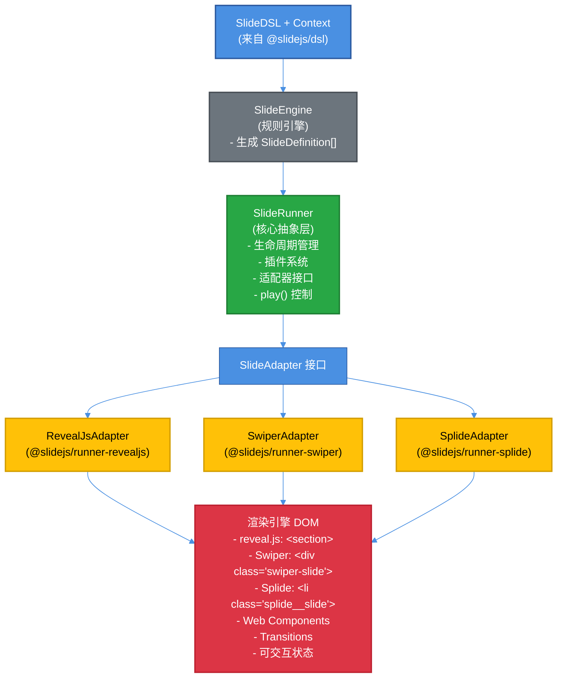

# RFC 0002: Slide Runner 与多渲染引擎集成

## 元数据

- **RFC ID**: 0002
- **标题**: Slide Runner - 可扩展的幻灯片执行引擎与多渲染引擎适配器
- **状态**: 已完成
- **创建日期**: 2025-12-25
- **作者**: Claude Code
- **相关 RFC**: RFC 0001 (Slide DSL)

## 摘要

Slide Runner 是一个可扩展的幻灯片执行引擎，负责将 Slide DSL 生成的 `SlideDefinition[]` 渲染为实际的演示文稿。本 RFC 定义了 SlideRunner 的核心架构、扩展机制，以及三个官方适配器的实现规范：

- `@slidejs/runner-revealjs` - reveal.js 适配器
- `@slidejs/runner-swiper` - Swiper.js 适配器
- `@slidejs/runner-splide` - Splide 适配器

**核心概念**：

- **Runner（运行器）**：负责协调 DSL 解析、幻灯片生成、适配器初始化和渲染
- **Play（播放）**：启动演示，导航到第一张幻灯片，使演示进入可交互状态
- **Adapter（适配器）**：将标准化的 `SlideDefinition[]` 渲染为特定渲染引擎（reveal.js、Swiper、Splide 等）的格式

## 动机

### 背景问题

1. **渲染引擎多样性**: 存在多种幻灯片框架（reveal.js, Swiper, Splide 等），需要支持不同的渲染引擎
2. **动态内容渲染**: Slide DSL 支持动态内容（Web Components），需要在运行时渲染
3. **可扩展性需求**: 用户应该能够自定义渲染逻辑、添加插件、扩展功能

### 设计目标

1. **引擎无关**: 核心 SlideRunner 不依赖于特定的渲染引擎
2. **可扩展**: 通过适配器模式支持多种渲染引擎
3. **类型安全**: 完整的 TypeScript 类型定义
4. **插件系统**: 支持生命周期钩子和插件扩展
5. **清晰的执行模型**: 明确区分初始化、渲染和播放阶段

## 详细设计

### 1. 架构概览



**说明**：此图表使用高对比度配色方案，确保在亮色和暗色模式下都清晰可见。颜色方案遵循语义化设计：

- **蓝色 (#4a90e2)**：DSL 输入层 - 高对比度，适合两种模式
- **灰色 (#6c757d)**：引擎处理层 - 中性色，通用性强
- **绿色 (#28a745)**：核心运行器 - 高饱和度，易于识别
- **黄色 (#ffc107)**：适配器层 - 注意文字为黑色以确保可读性
- **红色 (#dc3545)**：最终渲染输出 - 高对比度，醒目

**亮色/暗色模式适配**：

- 所有颜色使用高对比度值，确保在两种模式下都清晰可见
- 文字颜色根据背景自动调整（白色文字用于深色背景，黑色文字用于浅色背景）
- 如需完全自动适配，可通过 CSS 媒体查询覆盖 Mermaid 的默认样式

### 1.1 执行模型：初始化 → 渲染 → 播放

SlideRunner 的执行分为三个阶段：

1. **初始化（Initialization）**：
   - 解析 DSL 源代码
   - 编译为 `SlideDSL` 对象
   - 创建适配器实例
   - 初始化适配器（创建 DOM 结构、加载资源等）

2. **渲染（Rendering）**：
   - 使用 `SlideEngine` 生成 `SlideDefinition[]`
   - 执行插件钩子（`beforeRender`）
   - 调用适配器的 `render()` 方法
   - 将幻灯片渲染到 DOM
   - 执行插件钩子（`afterRender`）

3. **播放（Play）**：
   - 调用 `play()` 方法启动演示
   - 导航到第一张幻灯片（索引 0）
   - 使演示进入可交互状态（用户可以使用键盘、鼠标导航）

**关键区别**：

- `run()` 或 `renderSlides()`：完成初始化和渲染，但**不自动播放**
- `play()`：启动演示，导航到第一张幻灯片，使演示可交互
- 用户需要**显式调用 `play()`** 来开始演示

### 2. 核心概念：Runner 与 Play

#### 2.1 Runner（运行器）职责

`SlideRunner` 是核心协调器，负责：

1. **DSL 处理**：协调 DSL 解析和编译（通过 `@slidejs/dsl`）
2. **幻灯片生成**：使用 `SlideEngine` 从 DSL 和 Context 生成 `SlideDefinition[]`
3. **适配器管理**：初始化和管理 `SlideAdapter` 实例
4. **插件系统**：执行插件生命周期钩子
5. **播放控制**：提供 `play()` 方法启动演示

#### 2.2 Play（播放）概念

**Play 的定义**：

- **播放**是启动演示的动作，将演示从"准备就绪"状态转换为"可交互"状态
- 播放会导航到第一张幻灯片（索引 0），使演示进入可交互状态
- 播放后，用户可以使用键盘、鼠标或 API 导航幻灯片

**Play 与 Run 的区别**：

| 方法     | 作用          | 状态变化                 |
| -------- | ------------- | ------------------------ |
| `run()`  | 初始化 + 渲染 | 幻灯片已准备好，但未激活 |
| `play()` | 启动演示      | 导航到第一张，演示可交互 |

**执行顺序**：

```typescript
// 1. 创建 Runner
const runner = new SlideRunner({ ... });

// 2. 运行（初始化 + 渲染）
await runner.run(dsl, context);
// 此时：幻灯片已渲染到 DOM，但未激活

// 3. 播放（启动演示）
runner.play();
// 此时：导航到第一张幻灯片，演示可交互
```

#### 2.3 状态管理

Runner 维护以下状态：

- `isInitialized`: 适配器是否已初始化
- `isPlaying`: 演示是否正在播放
- `slides`: 当前幻灯片列表
- `currentIndex`: 当前幻灯片索引

### 3. 核心接口定义

#### 3.1 SlideAdapter（适配器接口）

**定义位置**: `@slidejs/runner/src/types.ts`

```typescript
/**
 * 幻灯片适配器接口
 * 所有渲染引擎适配器必须实现此接口
 */
export interface SlideAdapter {
  /**
   * 适配器名称（如 'revealjs', 'impressjs'）
   */
  readonly name: string;

  /**
   * 初始化适配器
   * @param container - 容器元素
   * @param options - 适配器特定的配置选项
   */
  initialize(container: HTMLElement, options?: AdapterOptions): Promise<void>;

  /**
   * 渲染幻灯片列表
   * @param slides - SlideDefinition 数组
   */
  render(slides: SlideDefinition[]): Promise<void>;

  /**
   * 销毁适配器，清理资源
   */
  destroy(): Promise<void>;

  /**
   * 导航到指定幻灯片
   * @param index - 幻灯片索引
   */
  navigateTo(index: number): void;

  /**
   * 获取当前幻灯片索引
   */
  getCurrentIndex(): number;

  /**
   * 获取总幻灯片数
   */
  getTotalSlides(): number;

  /**
   * 更新特定幻灯片（可选，用于响应式更新）
   * @param index - 幻灯片索引
   * @param slide - 新的 SlideDefinition
   */
  updateSlide?(index: number, slide: SlideDefinition): Promise<void>;

  /**
   * 监听适配器事件
   */
  on(event: AdapterEvent, handler: EventHandler): void;
  off(event: AdapterEvent, handler: EventHandler): void;
}

/**
 * 适配器配置选项（基类）
 */
export interface AdapterOptions {
  [key: string]: unknown;
}

/**
 * 适配器事件类型
 */
export type AdapterEvent = 'slideChanged' | 'slideRendered' | 'ready' | 'error';

export type EventHandler = (data?: unknown) => void;
```

#### 3.2 SlideRunner（核心运行器）

**定义位置**: `@slidejs/runner/src/runner.ts`

**核心方法说明**：

1. **`run(dsl, context)`**: 初始化 + 渲染
   - 解析 DSL，生成幻灯片
   - 初始化适配器
   - 渲染幻灯片到 DOM
   - **不自动播放**，需要手动调用 `play()`

2. **`renderSlides(slides)`**: 直接渲染（不使用 DSL）
   - 跳过 DSL 解析步骤
   - 直接渲染提供的 `SlideDefinition[]`
   - **不自动播放**，需要手动调用 `play()`

3. **`play()`**: 启动演示
   - 导航到第一张幻灯片（索引 0）
   - 使演示进入可交互状态
   - 必须在 `run()` 或 `renderSlides()` 之后调用

4. **`navigateTo(index)`**: 导航到指定幻灯片
   - 可以在播放前后调用
   - 触发插件钩子（`beforeSlideChange`、`afterSlideChange`）

5. **`getCurrentIndex()`**: 获取当前幻灯片索引

6. **`getTotalSlides()`**: 获取总幻灯片数

7. **`destroy()`**: 销毁 Runner，清理资源

```typescript
import type { SlideDSL, SlideDefinition } from '@slidejs/core';
import type { SlideContext } from '@slidejs/context';
import type { SlideAdapter, AdapterOptions } from './types';

/**
 * SlideRunner 配置
 */
export interface SlideRunnerConfig<TAdapterOptions extends AdapterOptions = AdapterOptions> {
  /**
   * 容器元素或选择器
   */
  container: HTMLElement | string;

  /**
   * 幻灯片适配器实例
   */
  adapter: SlideAdapter;

  /**
   * 适配器配置选项
   */
  adapterOptions?: TAdapterOptions;

  /**
   * 插件列表
   */
  plugins?: SlideRunnerPlugin[];
}

/**
 * SlideRunner 插件接口
 */
export interface SlideRunnerPlugin {
  /**
   * 插件名称
   */
  readonly name: string;

  /**
   * 在渲染前调用
   */
  beforeRender?(slides: SlideDefinition[]): Promise<SlideDefinition[]> | SlideDefinition[];

  /**
   * 在渲染后调用
   */
  afterRender?(slides: SlideDefinition[]): Promise<void> | void;

  /**
   * 在幻灯片切换前调用
   */
  beforeSlideChange?(from: number, to: number): Promise<boolean> | boolean;

  /**
   * 在幻灯片切换后调用
   */
  afterSlideChange?(from: number, to: number): Promise<void> | void;
}

/**
 * SlideRunner 核心类
 *
 * 职责：
 * 1. 协调 SlideEngine、SlideAdapter 和插件系统
 * 2. 管理幻灯片生命周期（初始化 → 渲染 → 播放）
 * 3. 提供统一的 API 控制演示
 */
export class SlideRunner<TContext extends SlideContext = SlideContext> {
  private adapter: SlideAdapter;
  private plugins: SlideRunnerPlugin[] = [];
  private container: HTMLElement;
  private slides: SlideDefinition[] = [];
  private isInitialized = false;
  private isPlaying = false;

  constructor(private config: SlideRunnerConfig) {
    this.adapter = config.adapter;
    this.plugins = config.plugins || [];
    this.container =
      typeof config.container === 'string'
        ? document.querySelector(config.container)!
        : config.container;

    if (!this.container) {
      throw new Error('Container element not found');
    }
  }

  /**
   * 运行幻灯片演示（初始化 + 渲染）
   *
   * 完整流程：
   * 1. 使用 SlideEngine 生成 slides
   * 2. 执行 beforeRender 插件钩子
   * 3. 初始化适配器
   * 4. 渲染 slides
   * 5. 执行 afterRender 插件钩子
   * 6. 设置事件监听
   *
   * **注意**：此方法只完成初始化和渲染，不会自动播放。
   * 需要调用 `play()` 方法来启动演示。
   *
   * @param dsl - Slide DSL 对象
   * @param context - 幻灯片上下文数据
   */
  async run(dsl: SlideDSL<TContext>, context: TContext): Promise<void> {
    // 1. 使用 SlideEngine 生成 slides
    const { SlideEngine } = await import('@slidejs/core');
    const engine = new SlideEngine(dsl);
    let slides = engine.generate(context);

    // 2. 执行 beforeRender 插件钩子
    for (const plugin of this.plugins) {
      if (plugin.beforeRender) {
        slides = await plugin.beforeRender(slides);
      }
    }

    // 3. 保存 slides
    this.slides = slides;

    // 4. 初始化适配器
    await this.adapter.initialize(this.container, this.config.adapterOptions);
    this.isInitialized = true;

    // 5. 渲染 slides
    await this.adapter.render(slides);

    // 6. 执行 afterRender 插件钩子
    for (const plugin of this.plugins) {
      if (plugin.afterRender) {
        await plugin.afterRender(slides);
      }
    }

    // 7. 设置事件监听
    this.setupEventListeners();
  }

  /**
   * 直接渲染 SlideDefinition 数组（不使用 DSL）
   *
   * **注意**：此方法只完成初始化和渲染，不会自动播放。
   * 需要调用 `play()` 方法来启动演示。
   *
   * @param slides - 幻灯片定义数组
   */
  async renderSlides(slides: SlideDefinition[]): Promise<void> {
    // 执行插件钩子
    for (const plugin of this.plugins) {
      if (plugin.beforeRender) {
        slides = await plugin.beforeRender(slides);
      }
    }

    this.slides = slides;
    await this.adapter.initialize(this.container, this.config.adapterOptions);
    this.isInitialized = true;
    await this.adapter.render(slides);

    for (const plugin of this.plugins) {
      if (plugin.afterRender) {
        await plugin.afterRender(slides);
      }
    }

    this.setupEventListeners();
  }

  /**
   * 播放/启动演示文稿
   *
   * **作用**：
   * - 导航到第一张幻灯片（索引 0）
   * - 使演示进入可交互状态
   * - 触发播放相关事件
   *
   * **调用时机**：
   * - 必须在 `run()` 或 `renderSlides()` 之后调用
   * - 可以多次调用（会重新导航到第一张幻灯片）
   *
   * **与 `run()` 的区别**：
   * - `run()`: 初始化 + 渲染（幻灯片已准备好，但未激活）
   * - `play()`: 启动演示（导航到第一张，使演示可交互）
   *
   * @throws {Error} 如果尚未初始化或没有幻灯片
   */
  play(): void {
    if (this.slides.length === 0) {
      throw new Error('No slides to play. Call run() or renderSlides() first.');
    }

    if (!this.isInitialized) {
      throw new Error('Adapter not initialized. Call run() or renderSlides() first.');
    }

    // 导航到第一张幻灯片
    this.navigateTo(0);
    this.isPlaying = true;
  }

  /**
   * 检查是否正在播放
   */
  isPlayingState(): boolean {
    return this.isPlaying;
  }

  /**
   * 检查是否已初始化
   */
  isInitializedState(): boolean {
    return this.isInitialized;
  }

  /**
   * 导航到指定幻灯片
   */
  navigateTo(index: number): void {
    this.adapter.navigateTo(index);
  }

  /**
   * 获取当前幻灯片索引
   */
  getCurrentIndex(): number {
    return this.adapter.getCurrentIndex();
  }

  /**
   * 获取总幻灯片数
   */
  getTotalSlides(): number {
    return this.adapter.getTotalSlides();
  }

  /**
   * 销毁 Runner
   */
  async destroy(): Promise<void> {
    await this.adapter.destroy();
  }

  /**
   * 设置事件监听
   */
  private setupEventListeners(): void {
    this.adapter.on('slideChanged', async data => {
      const { from, to } = data as { from: number; to: number };

      // 执行 beforeSlideChange 插件钩子
      for (const plugin of this.plugins) {
        if (plugin.beforeSlideChange) {
          const canProceed = await plugin.beforeSlideChange(from, to);
          if (canProceed === false) {
            // 阻止切换
            this.adapter.navigateTo(from);
            return;
          }
        }
      }

      // 执行 afterSlideChange 插件钩子
      for (const plugin of this.plugins) {
        if (plugin.afterSlideChange) {
          await plugin.afterSlideChange(from, to);
        }
      }
    });
  }
}
```

### 4. 适配器实现

#### 4.1 RevealJsAdapter（reveal.js 适配器）

**定义位置**: `@slidejs/runner-revealjs/src/adapter.ts`

```typescript
import type { SlideAdapter, AdapterOptions, AdapterEvent, EventHandler } from '@slidejs/runner';
import type { SlideDefinition } from '@slidejs/core';
import Reveal from 'reveal.js';

/**
 * reveal.js 配置选项
 */
export interface RevealJsOptions extends AdapterOptions {
  /**
   * reveal.js 原生配置
   * 参考: https://revealjs.com/config/
   */
  revealConfig?: Reveal.Options;

  /**
   * 主题名称
   */
  theme?:
    | 'black'
    | 'white'
    | 'league'
    | 'beige'
    | 'sky'
    | 'night'
    | 'serif'
    | 'simple'
    | 'solarized';

  /**
   * 自定义 CSS 类名前缀
   */
  classPrefix?: string;
}

/**
 * reveal.js 适配器
 */
export class RevealJsAdapter implements SlideAdapter {
  readonly name = 'revealjs';

  private reveal?: Reveal.Api;
  private container?: HTMLElement;
  private eventHandlers: Map<AdapterEvent, Set<EventHandler>> = new Map();

  async initialize(container: HTMLElement, options?: RevealJsOptions): Promise<void> {
    this.container = container;

    // 创建 reveal.js 所需的 DOM 结构
    const revealDiv = document.createElement('div');
    revealDiv.className = 'reveal';

    const slidesDiv = document.createElement('div');
    slidesDiv.className = 'slides';

    revealDiv.appendChild(slidesDiv);
    container.appendChild(revealDiv);

    // 加载主题（如果指定）
    if (options?.theme) {
      await this.loadTheme(options.theme);
    }

    // 初始化 reveal.js
    this.reveal = new Reveal(revealDiv, {
      embedded: true,
      ...options?.revealConfig,
    });

    // 设置事件监听
    this.reveal.on('slidechanged', event => {
      this.emit('slideChanged', {
        from: event.previousSlide ? this.getSlideIndex(event.previousSlide) : 0,
        to: this.getSlideIndex(event.currentSlide),
      });
    });

    this.reveal.on('ready', () => {
      this.emit('ready');
    });

    // initialize() 返回 Promise，等待初始化完成
    await this.reveal.initialize();
  }

  async render(slides: SlideDefinition[]): Promise<void> {
    if (!this.reveal) {
      throw new Error('RevealJsAdapter not initialized');
    }

    const slidesContainer = this.container!.querySelector('.slides') as HTMLElement;

    // 清空现有幻灯片
    slidesContainer.innerHTML = '';

    // 渲染每个幻灯片
    for (const slide of slides) {
      const section = await this.renderSlide(slide);
      slidesContainer.appendChild(section);
    }

    // 同步 reveal.js
    this.reveal.sync();
    this.emit('slideRendered');
  }

  async destroy(): Promise<void> {
    if (this.reveal) {
      this.reveal.destroy();
      this.reveal = undefined;
    }

    if (this.container) {
      this.container.innerHTML = '';
      this.container = undefined;
    }

    this.eventHandlers.clear();
  }

  navigateTo(index: number): void {
    if (this.reveal) {
      // reveal.js slide 方法需要 (indexh, indexv) 两个参数
      // 对于单层幻灯片，indexv 为 0
      this.reveal.slide(index, 0);
    }
  }

  getCurrentIndex(): number {
    if (!this.reveal) return 0;
    const indices = this.reveal.getIndices();
    return indices.h;
  }

  getTotalSlides(): number {
    if (!this.reveal) return 0;
    return this.reveal.getTotalSlides();
  }

  on(event: AdapterEvent, handler: EventHandler): void {
    if (!this.eventHandlers.has(event)) {
      this.eventHandlers.set(event, new Set());
    }
    this.eventHandlers.get(event)!.add(handler);
  }

  off(event: AdapterEvent, handler: EventHandler): void {
    this.eventHandlers.get(event)?.delete(handler);
  }

  /**
   * 渲染单个幻灯片
   */
  private async renderSlide(slide: SlideDefinition): Promise<HTMLElement> {
    const section = document.createElement('section');

    // 设置 ID
    if (slide.id) {
      section.id = slide.id;
    }

    // 设置 transition
    if (slide.behavior?.transition) {
      const transitionType = this.mapTransition(slide.behavior.transition);
      section.setAttribute('data-transition', transitionType);

      // 设置 transition speed（如果指定）
      if (slide.behavior.transition.speed) {
        const speed = this.mapTransitionSpeed(slide.behavior.transition.speed);
        section.setAttribute('data-transition-speed', speed);
      }
    }

    // 渲染内容
    if (slide.content.type === 'dynamic') {
      // 动态内容（Web Component）
      await this.renderDynamicContent(section, slide.content);
    } else {
      // 静态文本
      this.renderTextContent(section, slide.content);
    }

    return section;
  }

  /**
   * 渲染动态内容（Web Component）
   *
   * 支持所有 Web Components，包括：
   * - 标准 Web Components（原生 Custom Elements）
   * - wsx 组件（编译为标准 Web Components）
   * - 其他框架的 Web Components（Vue、React、Angular 等）
   */
  private async renderDynamicContent(
    container: HTMLElement,
    content: Extract<SlideDefinition['content'], { type: 'dynamic' }>
  ): Promise<void> {
    // 创建 Web Component 元素
    const element = document.createElement(content.component);

    // 设置属性
    for (const [key, value] of Object.entries(content.props)) {
      if (typeof value === 'string' || typeof value === 'number') {
        // 字符串和数字 → HTML attributes
        element.setAttribute(key, String(value));
      } else if (typeof value === 'boolean') {
        // 布尔值 → HTML attributes（true 时设置空属性）
        if (value) {
          element.setAttribute(key, '');
        }
      } else {
        // 对象和数组 → JavaScript properties
        (element as Record<string, unknown>)[key] = value;
      }
    }

    container.appendChild(element);
  }

  /**
   * 渲染文本内容
   */
  private renderTextContent(
    container: HTMLElement,
    content: Extract<SlideDefinition['content'], { type: 'text' }>
  ): void {
    content.lines.forEach(line => {
      const p = document.createElement('p');
      p.textContent = line;
      container.appendChild(p);
    });
  }

  /**
   * 映射 Slide DSL 的 transition type 到 reveal.js transition
   */
  private mapTransition(transition: SlideDefinition['behavior']['transition']): string {
    if (!transition) return 'slide';

    const typeMap: Record<string, string> = {
      slide: 'slide',
      zoom: 'zoom',
      fade: 'fade',
      cube: 'convex', // reveal.js 没有 cube，使用 convex 替代
      flip: 'concave', // reveal.js 没有 flip，使用 concave 替代
      none: 'none',
    };

    return typeMap[transition.type] || 'slide';
  }

  /**
   * 映射 Slide DSL 的 transition speed 到 reveal.js transition speed
   */
  private mapTransitionSpeed(speed: 'slow' | 'default' | 'fast' | number): string {
    if (typeof speed === 'number') {
      // reveal.js 不支持数字形式的 speed，使用默认值
      return 'default';
    }
    return speed;
  }

  /**
   * 加载 reveal.js 主题
   */
  private async loadTheme(theme: string): Promise<void> {
    const link = document.createElement('link');
    link.rel = 'stylesheet';
    link.href = `https://cdn.jsdelivr.net/npm/reveal.js@5/dist/theme/${theme}.css`;
    document.head.appendChild(link);

    return new Promise(resolve => {
      link.onload = () => resolve();
    });
  }

  /**
   * 获取幻灯片索引
   */
  private getSlideIndex(slide: Element): number {
    const slides = this.container!.querySelectorAll('.slides > section');
    return Array.from(slides).indexOf(slide);
  }

  /**
   * 触发事件
   */
  private emit(event: AdapterEvent, data?: unknown): void {
    const handlers = this.eventHandlers.get(event);
    if (handlers) {
      handlers.forEach(handler => handler(data));
    }
  }
}
```

### 5. 使用 Web Components（包括 wsx 组件）

#### 5.1 在 DSL 中使用 Web Components

Slide DSL 支持通过 `content dynamic` 使用任何 Web Component，包括 wsx 组件：

```dsl
slide {
  content dynamic {
    name: "my-quiz-question"    // Web Component 标签名
    attrs {                      // 组件属性
      question: "What is 2 + 2?"
      options: "[\"2\", \"3\", \"4\", \"5\"]"  // 数组作为 JSON 字符串
    }
  }
}
```

**属性映射规则**:

- **字符串和数字** → HTML attributes: `element.setAttribute('question', 'What is 2 + 2?')`
- **布尔值** → HTML attributes（true 时设置空属性）: `element.setAttribute('disabled', '')`
- **对象和数组** → JavaScript properties: `element.options = [...]`

#### 5.2 创建 wsx 组件

wsx 组件是标准的 Web Components，无需特殊配置即可在 Slide DSL 中使用：

```typescript
/** @jsxImportSource @wsxjs/wsx-core */
import { LightComponent, autoRegister, state } from '@wsxjs/wsx-core';

@autoRegister({ tagName: 'my-quiz-question' })
export class MyQuizQuestion extends LightComponent {
  @state private selectedOption: number | null = null;

  static get observedAttributes() {
    return ['question', 'options'];
  }

  protected onAttributeChanged(name: string, _oldValue: string, newValue: string) {
    if (name === 'question' || name === 'options') {
      this.selectedOption = null;
    }
  }

  private getQuestion(): string {
    return this.getAttribute('question') || 'No question provided';
  }

  private getOptions(): string[] {
    const optionsAttr = this.getAttribute('options') || '[]';
    try {
      return JSON.parse(optionsAttr);
    } catch (e) {
      console.error('Failed to parse options:', e);
      return [];
    }
  }

  render() {
    const question = this.getQuestion();
    const options = this.getOptions();

    return (
      <div className="my-quiz-question">
        <h3 className="my-quiz-question-title">{question}</h3>
        <div className="my-quiz-question-options">
          {options.map((opt: string, i: number) => (
            <button
              key={i}
              className={`my-quiz-question-option ${this.selectedOption === i ? 'selected' : ''}`}
              onClick={() => this.handleOptionClick(i, opt)}
            >
              {opt}
            </button>
          ))}
        </div>
      </div>
    );
  }
}
```

**关键点**:

- wsx 会自动检测同名 CSS 文件（`my-quiz-question.css`），无需手动导入
- 使用 `@autoRegister` 装饰器自动注册为 Web Component
- 组件在渲染前必须已导入并注册

#### 5.3 在主文件中导入组件

**reveal.js 示例**：

```typescript
import { createSlideRunner } from '@slidejs/runner-revealjs';
import type { SlideContext } from '@slidejs/context';
import 'reveal.js/dist/theme/black.css';

// 导入自定义 Web Component（必须在渲染前注册）
import './components/my-quiz-question.wsx';

// 导入 DSL 文件
import dslSource from './demo.slide?raw';

const context: SlideContext = {
  sourceType: 'quiz',
  sourceId: 'demo',
  items: [],
};

async function main() {
  const runner = await createSlideRunner(dslSource, context, {
    container: '#app',
    revealOptions: {
      controls: true,
      progress: true,
      center: true,
      transition: 'slide',
    },
  });
}

main();
```

**Swiper 示例**：

```typescript
import { createSlideRunner } from '@slidejs/runner-swiper';
import type { SlideContext } from '@slidejs/context';
import 'swiper/css';
import 'swiper/css/navigation';
import 'swiper/css/pagination';

// 导入自定义 Web Component
import './components/my-quiz-question.wsx';

const context: SlideContext = {
  sourceType: 'custom',
  sourceId: 'demo',
  items: [],
};

const runner = await createSlideRunner(dslSource, context, {
  container: '#app',
  swiperOptions: {
    navigation: true,
    pagination: { clickable: true },
  },
});

runner.play();
```

**Splide 示例**：

```typescript
import { createSlideRunner } from '@slidejs/runner-splide';
import type { SlideContext } from '@slidejs/context';
import '@splidejs/splide/css';

// 导入自定义 Web Component
import './components/my-quiz-question.wsx';

const context: SlideContext = {
  sourceType: 'custom',
  sourceId: 'demo',
  items: [],
};

const runner = await createSlideRunner(dslSource, context, {
  container: '#app',
  splideOptions: {
    type: 'slide',
    pagination: true,
    arrows: true,
  },
});

runner.play();
```

#### 5.4 完整示例

**DSL 文件** (`demo.slide`):

```dsl
present quiz "wsx-component-demo" {
  rules {
    rule start "intro" {
      slide {
        content text {
          "# Using WSX Components"
          "## Custom Web Components in Slides"
        }
        behavior {
          transition fade {}
        }
      }
    }

    rule content "quiz-slides" {
      slide {
        content dynamic {
          name: "my-quiz-question"
          attrs {
            question: "What is 2 + 2?"
            options: "[\"2\", \"3\", \"4\", \"5\"]"
          }
        }
        behavior {
          transition slide {}
        }
      }

      slide {
        content dynamic {
          name: "my-quiz-question"
          attrs {
            question: "Which is a JavaScript framework?"
            options: "[\"React\", \"Python\", \"Java\", \"C++\"]"
          }
        }
        behavior {
          transition slide {}
        }
      }
    }

    rule end "thanks" {
      slide {
        content text {
          "# Thank You!"
        }
        behavior {
          transition zoom {}
        }
      }
    }
  }
}
```

### 6. 使用示例

#### 6.1 基础使用（完整流程）

**reveal.js 适配器**：

```typescript
import { SlideRunner } from '@slidejs/runner';
import { RevealJsAdapter } from '@slidejs/runner-revealjs';
import { parseSlideDSL, compile } from '@slidejs/dsl';
import type { SlideContext } from '@slidejs/context';

// 1. 准备数据
const context: SlideContext = {
  sourceType: 'custom',
  sourceId: 'demo',
  metadata: { title: 'Demo' },
  items: [],
};

// 2. 解析 DSL
const dslSource = `
present quiz "my-quiz" {
  rules {
    rule start "intro" {
      slide {
        content text {
          "Welcome!"
        }
        behavior {
          transition zoom {
            speed "fast"
          }
        }
      }
    }
  }
}
`;

const ast = await parseSlideDSL(dslSource);
const slideDSL = compile(ast);

// 3. 创建 Runner
const runner = new SlideRunner({
  container: '#presentation',
  adapter: new RevealJsAdapter(),
  adapterOptions: {
    theme: 'black',
    revealConfig: {
      controls: true,
      progress: true,
      history: true,
    },
  },
});

// 4. 运行（初始化 + 渲染）
await runner.run(slideDSL, context);

// 5. 播放（启动演示，导航到第一张幻灯片）
runner.play();
```

**Swiper 适配器**：

```typescript
import { SlideRunner } from '@slidejs/runner';
import { SwiperAdapter } from '@slidejs/runner-swiper';
import { parseSlideDSL, compile } from '@slidejs/dsl';
import type { SlideContext } from '@slidejs/context';

const context: SlideContext = {
  sourceType: 'custom',
  sourceId: 'demo',
  metadata: { title: 'Demo' },
  items: [],
};

const dslSource = `...`;
const ast = await parseSlideDSL(dslSource);
const slideDSL = compile(ast);

const runner = new SlideRunner({
  container: '#presentation',
  adapter: new SwiperAdapter(),
  adapterOptions: {
    swiperConfig: {
      navigation: true,
      pagination: { clickable: true },
    },
  },
});

await runner.run(slideDSL, context);
runner.play();
```

**Splide 适配器**：

```typescript
import { SlideRunner } from '@slidejs/runner';
import { SplideAdapter } from '@slidejs/runner-splide';
import { parseSlideDSL, compile } from '@slidejs/dsl';
import type { SlideContext } from '@slidejs/context';

const context: SlideContext = {
  sourceType: 'custom',
  sourceId: 'demo',
  metadata: { title: 'Demo' },
  items: [],
};

const dslSource = `...`;
const ast = await parseSlideDSL(dslSource);
const slideDSL = compile(ast);

const runner = new SlideRunner({
  container: '#presentation',
  adapter: new SplideAdapter(),
  adapterOptions: {
    splideConfig: {
      type: 'slide',
      pagination: true,
      arrows: true,
    },
  },
});

await runner.run(slideDSL, context);
runner.play();
```

**执行流程说明**：

1. `run()` 完成初始化和渲染，幻灯片已准备好但未激活
2. `play()` 启动演示，导航到第一张幻灯片，使演示可交互
3. 用户可以使用键盘、鼠标或 API 导航幻灯片

#### 6.2 使用插件

```typescript
// 定义一个简单的插件：自动播放
const autoPlayPlugin: SlideRunnerPlugin = {
  name: 'auto-play',

  afterRender(slides) {
    console.log(`Rendered ${slides.length} slides, starting auto-play`);

    setInterval(() => {
      const currentIndex = runner.getCurrentIndex();
      const totalSlides = runner.getTotalSlides();

      if (currentIndex < totalSlides - 1) {
        runner.navigateTo(currentIndex + 1);
      }
    }, 5000); // 每 5 秒切换
  },
};

// 使用插件（适用于所有适配器）
const runner = new SlideRunner({
  container: '#presentation',
  adapter: new RevealJsAdapter(), // 或 SwiperAdapter、SplideAdapter
  plugins: [autoPlayPlugin],
});

await runner.run(slideDSL, context);

// 启动演示
runner.play();
```

#### 6.3 创建自定义适配器

```typescript
import type { SlideAdapter, AdapterOptions } from '@slidejs/runner';
import type { SlideDefinition } from '@slidejs/core';

class CustomAdapter implements SlideAdapter {
  readonly name = 'custom';

  async initialize(container: HTMLElement, options?: AdapterOptions): Promise<void> {
    // 初始化自定义渲染引擎
  }

  async render(slides: SlideDefinition[]): Promise<void> {
    // 实现自定义渲染逻辑
  }

  async destroy(): Promise<void> {
    // 清理资源
  }

  navigateTo(index: number): void {
    // 实现导航
  }

  getCurrentIndex(): number {
    return 0;
  }

  getTotalSlides(): number {
    return 0;
  }

  on(event: AdapterEvent, handler: EventHandler): void {
    // 实现事件监听
  }

  off(event: AdapterEvent, handler: EventHandler): void {
    // 移除事件监听
  }
}

// 使用自定义适配器
const runner = new SlideRunner({
  container: '#presentation',
  adapter: new CustomAdapter(),
});
```

### 7. 包结构

#### 7.1 @slidejs/runner（核心包）

```
packages/@slidejs/runner/
├── src/
│   ├── types.ts           # SlideAdapter 接口、事件类型等
│   ├── runner.ts          # SlideRunner 核心类
│   ├── errors.ts          # 错误类定义
│   └── index.ts
├── package.json
├── tsconfig.json
└── vite.config.ts
```

**依赖**: `@slidejs/core`, `@slidejs/context`

#### 7.2 @slidejs/runner-revealjs（reveal.js 适配器）

```
packages/@slidejs/runner-revealjs/
├── src/
│   ├── adapter.ts         # RevealJsAdapter 实现
│   ├── runner.ts          # createSlideRunner 工厂函数
│   ├── types.ts           # reveal.js 特定类型
│   └── index.ts
├── package.json
├── tsconfig.json
└── vite.config.ts
```

**依赖**: `@slidejs/runner`, `@slidejs/core`, `@slidejs/dsl`, `@slidejs/context`, `reveal.js`

#### 7.3 @slidejs/runner-swiper（Swiper.js 适配器）

```
packages/@slidejs/runner-swiper/
├── src/
│   ├── adapter.ts         # SwiperAdapter 实现
│   ├── runner.ts          # createSlideRunner 工厂函数
│   ├── types.ts           # Swiper 特定类型
│   └── index.ts
├── package.json
├── tsconfig.json
└── vite.config.ts
```

**依赖**: `@slidejs/runner`, `@slidejs/core`, `@slidejs/dsl`, `@slidejs/context`, `swiper`

#### 7.4 @slidejs/runner-splide（Splide 适配器）

```
packages/@slidejs/runner-splide/
├── src/
│   ├── adapter.ts         # SplideAdapter 实现
│   ├── runner.ts          # createSlideRunner 工厂函数
│   ├── types.ts           # Splide 特定类型
│   └── index.ts
├── package.json
├── tsconfig.json
└── vite.config.ts
```

**依赖**: `@slidejs/runner`, `@slidejs/core`, `@slidejs/dsl`, `@slidejs/context`, `@splidejs/splide`

### 8. 扩展机制

#### 8.1 生命周期钩子

SlideRunner 提供以下生命周期钩子：

1. **beforeRender**: 在渲染前修改 slides
2. **afterRender**: 在渲染后执行操作
3. **beforeSlideChange**: 在幻灯片切换前执行验证或预处理
4. **afterSlideChange**: 在幻灯片切换后执行操作

#### 8.2 适配器扩展点

自定义适配器可以：

1. 实现 `SlideAdapter` 接口
2. 支持特定渲染引擎的功能
3. 提供自定义事件和 API

#### 8.3 插件系统

插件可以：

1. 拦截和修改 slides
2. 添加全局功能（如自动播放、键盘快捷键）
3. 集成第三方服务（如分析、录制）

### 9. SlideDefinition 类型扩展

为了支持 reveal.js 的高级功能，需要扩展 `@slidejs/core` 中的 `SlideDefinition` 类型：

```typescript
// @slidejs/core/src/types.ts 扩展

/**
 * 幻灯片定义（扩展版）
 */
export interface SlideDefinition {
  id?: string;
  content: SlideContent;
  behavior?: SlideBehavior;
  metadata?: Record<string, unknown>;

  // 新增：reveal.js 特定功能
  /**
   * 幻灯片背景配置
   */
  background?: SlideBackground;

  /**
   * 演讲者备注
   */
  notes?: string;

  /**
   * Fragments 配置（逐步显示）
   */
  fragments?: FragmentDefinition[];

  /**
   * 垂直嵌套的子幻灯片（2D 布局）
   */
  children?: SlideDefinition[];

  /**
   * 自定义 data 属性
   */
  dataAttributes?: Record<string, string>;
}

/**
 * 幻灯片背景配置
 */
export interface SlideBackground {
  type: 'color' | 'image' | 'video' | 'iframe';
  value: string;
  size?: string;
  position?: string;
  repeat?: 'repeat' | 'no-repeat';
  opacity?: number;
  transition?: 'fade' | 'slide' | 'convex' | 'concave' | 'zoom' | 'none';
}

/**
 * Fragment 定义
 */
export interface FragmentDefinition {
  /**
   * Fragment 索引（控制显示顺序）
   */
  index?: number;

  /**
   * Fragment 样式
   */
  style?:
    | 'fade-in'
    | 'fade-out'
    | 'fade-up'
    | 'fade-down'
    | 'grow'
    | 'shrink'
    | 'highlight-red'
    | 'highlight-blue'
    | 'highlight-green';

  /**
   * 应用 fragment 的内容
   */
  content: string | HTMLElement;
}
```

**向后兼容性**: 这些扩展属性都是可选的，不影响现有代码。

### 10. 技术考虑

#### 10.1 性能优化

1. **懒加载**: 仅在需要时加载 reveal.js 和主题
2. **虚拟渲染**: 对于大量幻灯片，只渲染可见部分
3. **资源预加载**: 预加载下一张幻灯片的资源

#### 10.2 Web Components 支持

**默认支持**: Slide DSL 和 RevealJsAdapter 默认支持所有 Web Components，包括使用 wsx 创建的组件。因为 wsx 组件编译为标准 Web Components，无需特殊配置即可使用。

1. **自定义元素注册**: 确保 Web Components 在渲染前已注册
   - wsx 组件通过 `@autoRegister` 装饰器自动注册
   - 只需在渲染前导入组件文件即可

2. **属性传递**: 支持简单类型和复杂对象的属性传递
   - 字符串、数字、布尔值 → HTML attributes
   - 对象、数组 → JavaScript properties
   - 数组需要作为 JSON 字符串传递（DSL 语法限制）

3. **生命周期管理**: 正确管理组件的创建和销毁
   - Web Components 在插入 DOM 时自动初始化
   - 使用 Shadow DOM 的组件样式自动隔离

4. **wsx 组件特殊支持**:
   - wsx 组件自动检测同名 CSS 文件（无需手动导入）
   - 支持 `@state` 装饰器的响应式状态
   - 支持 `observedAttributes` 和 `onAttributeChanged`

#### 10.3 错误处理

1. **优雅降级**: 当 Web Component 加载失败时显示错误信息
2. **恢复机制**: 提供重试和回退选项
3. **详细日志**: 记录渲染过程中的错误和警告

#### 8.4 reveal.js 高级功能支持

1. **Fragments（片段）**: 支持逐步显示内容

   ```typescript
   // 在 SlideDefinition 中扩展支持 fragments
   interface SlideContent {
     fragments?: FragmentDefinition[];
   }

   interface FragmentDefinition {
     index?: number;
     style?: 'fade-in' | 'fade-out' | 'grow' | 'shrink' | 'highlight-red';
     element: HTMLElement | string;
   }
   ```

2. **Background（背景）**: 支持幻灯片背景

   ```typescript
   interface SlideDefinition {
     background?: {
       type: 'color' | 'image' | 'video' | 'iframe';
       value: string;
       size?: string;
       position?: string;
       repeat?: string;
       opacity?: number;
     };
   }
   ```

3. **Auto-slide（自动播放）**: 配置自动切换

   ```typescript
   interface RevealJsOptions {
     autoSlide?: number; // 自动切换间隔（毫秒）
     autoSlideStoppable?: boolean;
     autoSlideMethod?: 'next' | 'random';
   }
   ```

4. **代码高亮**: 集成 highlight.js 或 Prism.js

   ```typescript
   // RevealJsAdapter 自动加载代码高亮插件
   private async loadCodeHighlight(): Promise<void> {
     // 加载 highlight.js
     await import('highlight.js');
     // 应用高亮
     this.reveal.getPlugin('highlight')?.highlightAll();
   }
   ```

5. **数学公式**: 集成 MathJax 或 KaTeX

   ```typescript
   interface RevealJsOptions {
     math?: {
       mathjax?: string; // MathJax CDN URL
       config?: 'TeX-AMS_HTML-full';
     };
   }
   ```

6. **Speaker Notes（演讲者备注）**: 支持演讲者视图
   ```typescript
   interface SlideDefinition {
     notes?: string; // 演讲者备注内容
   }
   ```

#### 8.5 响应式更新机制

1. **重新渲染**: 当数据变化时更新幻灯片

   ```typescript
   class SlideRunner {
     /**
      * 更新特定幻灯片
      */
     async updateSlide(index: number, slide: SlideDefinition): Promise<void> {
       this.slides[index] = slide;
       await this.adapter.updateSlide(index, slide);
     }

     /**
      * 重新渲染所有幻灯片
      */
     async refresh(): Promise<void> {
       await this.adapter.render(this.slides);
     }
   }
   ```

2. **状态管理**: 持久化幻灯片状态

   ```typescript
   interface SlideRunnerConfig {
     /**
      * 启用状态持久化
      */
     persistState?: boolean;

     /**
      * 状态存储键
      */
     stateKey?: string;
   }
   ```

#### 8.6 可访问性（a11y）

1. **ARIA 标签**: 自动添加适当的 ARIA 属性

   ```typescript
   // RevealJsAdapter 自动添加
   section.setAttribute('role', 'region');
   section.setAttribute('aria-label', `Slide ${index + 1}`);
   ```

2. **键盘导航**: 确保所有功能可通过键盘访问

3. **屏幕阅读器支持**: 提供替代文本和描述

#### 8.7 移动端支持

1. **触摸手势**: 支持滑动切换幻灯片

   ```typescript
   interface RevealJsOptions {
     touch?: boolean;
     touchOneSlidePerSwipe?: boolean;
   }
   ```

2. **响应式布局**: 自动适配不同屏幕尺寸

3. **性能优化**: 移动端的特殊优化

## Runner 规范总结

### 执行模型

```mermaid
%%{init: {'theme':'base', 'themeVariables': {'primaryColor':'#4a90e2','primaryTextColor':'#ffffff','primaryBorderColor':'#2c5aa0','lineColor':'#4a90e2','secondaryColor':'#6c757d','tertiaryColor':'#f8f9fa','noteBkgColor':'#ffffff','noteTextColor':'#000000','noteBorderColor':'#4a90e2','actorBorder':'#4a90e2','actorBkg':'#e3f2fd','actorTextColor':'#000000','actorLineColor':'#4a90e2','signalColor':'#4a90e2','signalTextColor':'#000000','labelBoxBkgColor':'#ffffff','labelBoxBorderColor':'#4a90e2','labelTextColor':'#000000','loopTextColor':'#000000','activationBorderColor':'#4a90e2','activationBkgColor':'#e3f2fd','sequenceNumberColor':'#ffffff','sectionBkgColor':'#f8f9fa','altBkgColor':'#ffffff','cScale0':'#4a90e2','cScale1':'#6c757d','cScale2':'#28a745','cScale3':'#ffc107','cScale4':'#dc3545'}}}%%
flowchart TD
    Start([开始]) --> Init["1. 初始化阶段<br/>(Initialization)"]
    Init --> Init1["解析 DSL 源代码"]
    Init1 --> Init2["编译为 SlideDSL 对象"]
    Init2 --> Init3["创建适配器实例"]
    Init3 --> Render["2. 渲染阶段<br/>(Rendering)"]
    Render --> Render1["使用 SlideEngine 生成<br/>SlideDefinition[]"]
    Render1 --> Render2["执行 beforeRender<br/>插件钩子"]
    Render2 --> Render3["初始化适配器<br/>(创建 DOM 结构)"]
    Render3 --> Render4["调用适配器 render()<br/>渲染幻灯片"]
    Render4 --> Render5["执行 afterRender<br/>插件钩子"]
    Render5 --> Render6["设置事件监听"]
    Render6 --> Play["3. 播放阶段<br/>(Play)"]
    Play --> Play1["导航到第一张幻灯片<br/>(索引 0)"]
    Play1 --> Play2["使演示进入可交互状态"]
    Play2 --> Play3["用户可以使用键盘/鼠标/API 导航"]
    Play3 --> End([结束])

    classDef initClass fill:#4a90e2,stroke:#2c5aa0,stroke-width:2px,color:#ffffff
    classDef renderClass fill:#28a745,stroke:#1e7e34,stroke-width:2px,color:#ffffff
    classDef playClass fill:#ffc107,stroke:#d39e00,stroke-width:2px,color:#000000
    classDef stepClass fill:#6c757d,stroke:#495057,stroke-width:1px,color:#ffffff
    classDef startEndClass fill:#dc3545,stroke:#bd2130,stroke-width:2px,color:#ffffff

    class Init initClass
    class Render renderClass
    class Play playClass
    class Init1,Init2,Init3,Render1,Render2,Render3,Render4,Render5,Render6,Play1,Play2,Play3 stepClass
    class Start,End startEndClass
```



**说明**：此流程图展示了 SlideRunner 的完整执行模型，从初始化到播放的三个阶段。颜色方案使用高对比度配色，确保在亮色和暗色模式下都清晰可见：

- **蓝色 (#4a90e2)**：初始化阶段 - 高对比度，适合两种模式
- **绿色 (#28a745)**：渲染阶段 - 高饱和度，易于识别
- **黄色 (#ffc107)**：播放阶段 - 注意文字为黑色以确保可读性
- **灰色 (#6c757d)**：具体步骤 - 中性色，通用性强
- **红色 (#dc3545)**：开始/结束节点 - 高对比度，醒目

**亮色/暗色模式适配**：

- 所有颜色使用高对比度值，确保在两种模式下都清晰可见
- 文字颜色根据背景自动调整（白色文字用于深色背景，黑色文字用于浅色背景）
- 如需完全自动适配，可通过 CSS 媒体查询覆盖 Mermaid 的默认样式

### API 规范

**核心方法**：

1. **`run(dsl, context): Promise<void>`**
   - 作用：初始化 + 渲染
   - 状态：`isInitialized = true`
   - 不自动播放，需要手动调用 `play()`

2. **`renderSlides(slides): Promise<void>`**
   - 作用：直接渲染（跳过 DSL 解析）
   - 状态：`isInitialized = true`
   - 不自动播放，需要手动调用 `play()`

3. **`play(): void`**
   - 作用：启动演示，导航到第一张幻灯片
   - 状态：`isPlaying = true`
   - 前置条件：必须已调用 `run()` 或 `renderSlides()`

4. **`navigateTo(index): void`**
   - 作用：导航到指定幻灯片
   - 触发：`beforeSlideChange`、`afterSlideChange` 插件钩子

5. **`getCurrentIndex(): number`**
   - 返回：当前幻灯片索引

6. **`getTotalSlides(): number`**
   - 返回：总幻灯片数

7. **`destroy(): Promise<void>`**
   - 作用：清理资源，销毁适配器

### 使用模式

**模式 1：完整流程（推荐）**

```typescript
const runner = new SlideRunner({ ... });
await runner.run(dsl, context);  // 初始化 + 渲染
runner.play();                    // 启动演示
```

**模式 2：分步控制**

```typescript
const runner = new SlideRunner({ ... });
await runner.run(dsl, context);  // 初始化 + 渲染

// 可以延迟播放，或根据条件决定是否播放
if (shouldAutoPlay) {
  runner.play();
}
```

**模式 3：直接渲染（不使用 DSL）**

```typescript
const runner = new SlideRunner({ ... });
await runner.renderSlides(slides);  // 直接渲染
runner.play();                       // 启动演示
```

## 实施计划

### Phase 1: 核心基础设施 ✅ 已完成

- [x] 创建 `@slidejs/runner` 包
- [x] 实现 `SlideRunner` 核心类
- [x] 定义 `SlideAdapter` 接口
- [x] 实现插件系统（支持 beforeRender, afterRender, beforeSlideChange, afterSlideChange）
- [x] 实现 `play()` 方法和状态管理

### Phase 2: 适配器实现 ✅ 已完成

- [x] 创建 `@slidejs/runner-revealjs` 包
- [x] 实现 `RevealJsAdapter`
- [x] 支持所有 transition 类型（slide, zoom, fade, cube, flip, none）
- [x] 处理动态内容和静态文本
- [x] 实现 `play()` 相关功能（通过 `createSlideRunner` 工厂函数）
- [x] 创建 `@slidejs/runner-swiper` 包
- [x] 实现 `SwiperAdapter`
- [x] 支持 Swiper 的所有核心功能（navigation, pagination, keyboard）
- [x] 创建 `@slidejs/runner-splide` 包
- [x] 实现 `SplideAdapter`
- [x] 支持 Splide 的所有核心功能（arrows, pagination, keyboard）

### Phase 3: 测试与文档 ✅ 已完成

- [x] 编写单元测试（已创建完整的测试套件）
- [x] 创建集成测试示例（`demos/slidejs-revealjs` 已创建）
- [x] 编写使用文档（部分内容已在 README 和文档中）
- [x] 创建示例项目（revealjs, swiper, splide 三个示例已创建）

### Phase 4: 高级功能 ⚠️ 部分完成

- [x] 其他适配器（Swiper 和 Splide 适配器已实现）
- [ ] 高级 reveal.js 功能（见 RFC 0005）
- [ ] 插件市场（见 RFC 0006）

## 实施状态总结

### ✅ 已完成功能

1. **核心 Runner**：SlideRunner 类已实现，支持完整的生命周期管理
2. **适配器接口**：SlideAdapter 接口已定义
3. **reveal.js 适配器**：RevealJsAdapter 已实现，支持所有基础功能
4. **Swiper 适配器**：SwiperAdapter 已实现，支持所有核心功能
5. **Splide 适配器**：SplideAdapter 已实现，支持所有核心功能
6. **工厂函数**：所有适配器都提供了 `createSlideRunner` 工厂函数，简化使用
7. **插件系统**：完整的插件钩子系统已实现
8. **多适配器支持**：reveal.js, Swiper, Splide 三个适配器已实现
9. **示例项目**：三个演示项目已创建（revealjs, swiper, splide）
10. **单元测试**：完整的测试套件已创建，28 个测试用例全部通过

### ⚠️ 待完成功能（未来增强）

1. **高级 reveal.js 功能**：Fragments、Background、Notes 等（见 RFC 0005）
2. **插件市场**：插件生态系统（见 RFC 0006）

**注意**：性能优化（虚拟滚动、懒加载）不在当前计划中，原因：

- reveal.js 等渲染引擎已内置性能优化
- 大多数演示文稿的幻灯片数量不会达到需要虚拟滚动的规模（通常 < 100 张）
- 过早优化可能增加复杂度而收益有限
- 如果未来确实需要，可以在 RFC 0005 中作为可选功能实现

## 实施状态

**RFC 0002 的核心功能已全部完成** ✅

所有计划的核心功能都已实现并通过测试。Slide Runner 规范已完全实施，可以用于生产环境。高级功能和插件市场作为未来增强功能，已创建独立的 RFC 文档。

## 风险评估

### 技术风险

1. **渲染引擎版本兼容性**:
   - 风险等级: 中
   - 缓解: 锁定特定版本，提供升级指南
   - 影响范围: reveal.js, Swiper, Splide 三个适配器

2. **Web Components 兼容性**:
   - 风险等级: 低
   - 缓解: 使用 polyfill 支持旧浏览器

3. **性能问题**:
   - 风险等级: 中
   - 缓解: 懒加载、虚拟渲染

## 替代方案

### 方案 A: 直接集成单个渲染引擎（不使用适配器）

- **优点**: 实现简单，无额外抽象
- **缺点**: 无法支持其他渲染引擎，不可扩展

### 方案 B: 使用 iframe 隔离

- **优点**: 样式隔离，安全性高
- **缺点**: 通信复杂，性能开销

### 方案 C: 自研渲染引擎

- **优点**: 完全控制
- **缺点**: 开发成本高，不成熟

**选择**: 我们选择适配器模式（本 RFC），因为：

1. 可扩展性最佳
2. 利用成熟的渲染引擎（reveal.js, Swiper, Splide）
3. 用户可以自定义适配器
4. 支持多种渲染引擎，满足不同使用场景

## 未解决问题

### 核心功能相关

1. **嵌套幻灯片**: reveal.js 支持垂直嵌套（2D 布局），是否需要在 Slide DSL 中支持？
   - **建议**: Phase 2 中添加，通过 `SlideDefinition` 的 `children` 属性支持

2. **Markdown 支持**: reveal.js 支持 Markdown 语法，是否需要在 DSL 中支持？
   - **建议**: 作为插件提供，不内置到核心

3. **多媒体控制**: 视频、音频的播放控制和同步
   - **建议**: Phase 3 中添加，提供媒体 API

### 高级功能相关

4. **PDF 导出**: 是否需要提供导出为 PDF 的功能？
   - **建议**: 依赖 reveal.js 内置的打印功能，提供便捷封装

5. **实时协作**: 是否需要支持多人协作演示？
   - **建议**: 作为独立插件开发，使用 WebRTC 或 WebSocket

6. **演讲者视图同步**: 演讲者视图和观众视图的状态同步
   - **建议**: Phase 4 中实现，基于事件系统

### 性能和优化相关

7. **虚拟滚动**: 对于超大型演示（100+ 幻灯片）的性能优化
   - **建议**: Phase 4 中实现，仅渲染可见幻灯片及其前后各一张

8. **资源懒加载**: 图片、视频等资源的按需加载策略
   - **建议**: Phase 3 中实现，基于 Intersection Observer

9. **离线支持**: Service Worker 和 PWA 支持
   - **建议**: 作为可选功能，在文档中提供指南

### 开发体验相关

10. **热更新**: 开发环境中的实时预览和热更新
    - **建议**: 提供开发工具包，集成 HMR

11. **调试工具**: 幻灯片调试和性能分析工具
    - **建议**: 作为浏览器扩展开发

12. **类型安全**: 更强的类型推导和验证
    - **建议**: 持续改进 TypeScript 类型定义

这些问题将在实施过程中根据实际需求和优先级决定。

## 参考资料

- [reveal.js 官方文档](https://revealjs.com/)
- [reveal.js API 文档](https://revealjs.com/api/)
- [Swiper.js 官方文档](https://swiperjs.com/)
- [Swiper.js API 文档](https://swiperjs.com/swiper-api)
- [Splide 官方文档](https://splidejs.com/)
- [Splide API 文档](https://splidejs.com/guides/options/)
- [Web Components 标准](https://www.webcomponents.org/)
- RFC 0001: Slide DSL

## Sources

- [API Methods | reveal.js](https://revealjs.com/api/)
- [The HTML presentation framework | reveal.js](https://revealjs.com/)
- [GitHub - hakimel/reveal.js](https://github.com/hakimel/reveal.js)
- [Swiper.js Documentation](https://swiperjs.com/)
- [Splide Documentation](https://splidejs.com/)

## 变更历史

- 2025-12-25: 初始草稿，定义 SlideRunner 架构和 reveal.js 适配器规范
- 2025-12-29: 添加 Swiper 和 Splide 适配器支持，更新标题和内容以反映所有三个适配器
