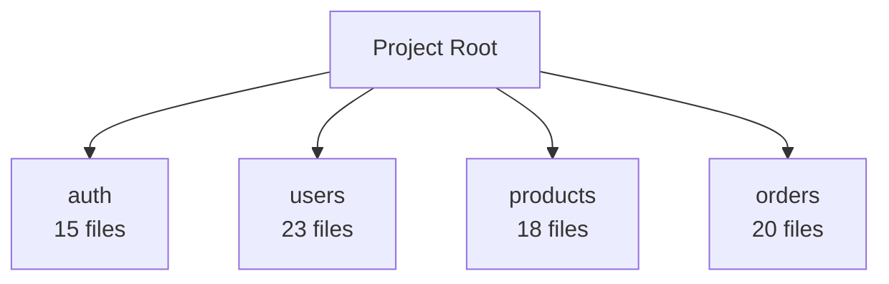

# 项目架构文档生成器

自动分析项目结构、代码组织和技术栈，生成专业的架构文档和图表。

## ✨ 功能特性

- 🔍 **智能扫描**: 自动分析项目目录结构和代码组织
- 📊 **架构分析**: 识别架构模式、技术栈和设计模式
- 🎨 **可视化**: 自动生成 Mermaid 架构图和流程图
- 📝 **完整文档**: 生成包含概览、模块、依赖等完整文档
- 🤖 **AI 增强**: 使用启发式规则提供架构洞察和建议
- 📦 **依赖分析**: 分析并可视化项目依赖关系
- 🎯 **多格式支持**: 支持 Markdown、HTML、PDF 等格式
- ⚡ **快速生成**: 几秒钟内完成完整文档生成

## 🚀 快速开始

### 基础使用

```bash
# 生成完整的项目文档
claude skill project-doc-generator generate

# 输出到自定义目录
claude skill project-doc-generator generate --output docs/arch

# 使用详细分析模式
claude skill project-doc-generator generate --depth comprehensive
```

### 生成架构图

```bash
# 仅生成架构图
claude skill project-doc-generator diagrams

# 生成图并包含在文档中
claude skill project-doc-generator generate --generate-diagrams true
```

### AI 增强分析

```bash
# 使用 AI 增强分析
claude skill project-doc-generator generate --ai-enhanced true

# 这将提供:
# • 架构模式识别
# • 代码质量评估
# • 改进建议
# • 最佳实践推荐
```

## 📖 生成的文档

执行后会在输出目录生成以下文档：

```
docs/architecture/
├── README.md                # 文档索引和快速导航
├── ARCHITECTURE.md          # 架构概览和设计说明
├── MODULES.md              # 模块详细说明
├── DEPENDENCIES.md         # 依赖关系分析
├── STACK.md                # 技术栈详情
├── diagrams/               # 架构图表目录
│   ├── modules.md         # 模块架构图
│   ├── tech-stack.md      # 技术栈图
│   └── directory.md       # 目录结构图
└── analysis/               # 分析数据（JSON）
    ├── structure.json     # 项目结构数据
    ├── stack.json         # 技术栈数据
    ├── dependencies.json  # 依赖数据
    └── ai-insights.json   # AI 洞察数据
```

## 📋 文档内容

### 1. 架构概览 (ARCHITECTURE.md)

- **项目概述**: 规模、统计信息
- **技术栈**: 编程语言、框架、工具
- **架构模式**: 识别的设计模式
- **目录结构**: 可视化的目录树
- **核心模块**: 主要模块说明
- **AI 洞察**: 架构建议和最佳实践

### 2. 模块说明 (MODULES.md)

- **模块列表**: 所有模块的概览表格
- **模块详情**: 每个模块的详细信息
- **文件列表**: 模块包含的文件
- **职责说明**: 模块功能描述

### 3. 依赖关系 (DEPENDENCIES.md)

- **NPM 依赖**: 生产和开发依赖列表
- **模块依赖**: 内部模块依赖关系
- **依赖图**: 依赖关系可视化

### 4. 架构图表 (diagrams/)

- **模块架构图**: 展示模块之间的关系
- **技术栈图**: 展示使用的技术栈
- **目录结构图**: 展示项目目录组织

## ⚙️ 配置选项

### 命令行参数

| 参数 | 说明 | 默认值 |
|------|------|--------|
| `--root` | 项目根目录 | `.` |
| `--output` | 输出目录 | `docs/architecture` |
| `--format` | 输出格式 | `markdown` |
| `--depth` | 分析深度 | `detailed` |
| `--include-examples` | 包含代码示例 | `true` |
| `--generate-diagrams` | 生成架构图 | `true` |
| `--analyze-dependencies` | 依赖分析 | `true` |
| `--ai-enhanced` | AI 增强 | `true` |

### 分析深度

- **basic**: 基础分析，快速生成
- **detailed**: 详细分析，包含更多信息（推荐）
- **comprehensive**: 全面分析，包含所有细节

## 🎯 使用场景

### 场景 1: 新项目文档

为新项目快速生成初始文档：

```bash
# 在项目根目录
cd my-project

# 生成文档
claude skill project-doc-generator generate

# 查看结果
open docs/architecture/README.md
```

### 场景 2: 项目重构前分析

重构前了解项目现状：

```bash
# 生成详细分析
claude skill project-doc-generator generate \
  --depth comprehensive \
  --ai-enhanced true

# 查看 AI 建议
cat docs/architecture/analysis/ai-insights.json
```

### 场景 3: 技术分享和汇报

准备技术分享材料：

```bash
# 生成包含图表的文档
claude skill project-doc-generator generate \
  --generate-diagrams true \
  --include-examples true

# 导出为 PDF
claude skill project-doc-generator export --format pdf
```

### 场景 4: 新人 Onboarding

帮助新成员快速了解项目：

```bash
# 生成完整文档
claude skill project-doc-generator generate \
  --depth detailed \
  --include-examples true

# 新成员可以从 docs/architecture/README.md 开始阅读
```

## 🔍 AI 增强功能

当启用 AI 增强（`--ai-enhanced true`）时，会提供：

### 架构模式识别

- MVC (Model-View-Controller)
- 微服务架构
- 分层架构
- 事件驱动架构
- 插件架构

### 代码质量评估

- **代码质量分数**: 基于文件大小、复杂度等指标
- **模块化程度**: 评估模块划分的合理性
- **可维护性**: 评估代码的可维护性

### 架构建议

- 文件大小优化建议
- 模块化改进建议
- 测试覆盖率建议
- 依赖管理建议

## 📊 示例输出

### 架构概览示例

```markdown
# My Project - 架构概览

> 一个现代化的 Web 应用项目

**版本**: 1.0.0
**生成时间**: 2024-01-10

---

## 📋 项目概述

### 项目规模

| 指标 | 数值 |
|------|------|
| 总文件数 | 234 |
| 代码文件 | 156 |
| 代码行数 | 12,456 |
| 模块数量 | 12 |

## 🛠️ 技术栈

### 编程语言
- TypeScript
- JavaScript

### 框架和库
- React
- Vite
- Express

### 开发工具
- ESLint
- Prettier
- Jest

## 🏗️ 架构模式

### 分层架构

项目采用了分层架构，清晰地划分了不同层次的职责

**优势**:
- 职责明确
- 易于维护
- 支持测试
```

### 模块架构图示例



## 🛠️ 高级用法

### 自定义配置文件

创建 `project-doc-generator.config.js`:

```javascript
module.exports = {
  output: 'docs/architecture',
  depth: 'comprehensive',
  generateDiagrams: true,
  analyzeDependencies: true,
  aiEnhanced: true,

  // 自定义排除规则
  exclude: [
    '**/node_modules/**',
    '**/dist/**',
    '**/*.test.js'
  ],

  // 自定义模块识别
  modules: {
    patterns: ['src/*', 'packages/*']
  },

  // 自定义架构图
  diagrams: {
    modules: true,
    techStack: true,
    dependencies: true,
    dataFlow: true
  }
};
```

### 持续集成

在 GitHub Actions 中自动生成文档：

```yaml
name: 生成架构文档

on:
  push:
    branches: [main]

jobs:
  docs:
    runs-on: ubuntu-latest
    steps:
      - uses: actions/checkout@v3
      - uses: actions/setup-node@v3
      - run: npm install
      - run: npx claude skill project-doc-generator generate
      - name: 提交文档
        run: |
          git config --local user.email "action@github.com"
          git config --local user.name "GitHub Action"
          git add docs/architecture
          git commit -m "docs: 更新架构文档" || exit 0
          git push
```

## 🔧 故障排除

### 问题 1: 生成的文档为空

**原因**: 项目结构无法识别

**解决**:
1. 确保项目包含 `src` 或 `lib` 目录
2. 检查是否有代码文件
3. 使用 `--depth comprehensive` 尝试更深入的分析

### 问题 2: 架构图无法显示

**原因**: Markdown 查看器不支持 Mermaid

**解决**:
1. 使用支持 Mermaid 的查看器（GitHub、GitLab、Typora）
2. 或访问 [Mermaid Live Editor](https://mermaid.live/) 粘贴代码查看

### 问题 3: AI 分析结果不准确

**原因**: 项目结构特殊或规模过大

**解决**:
1. 使用自定义配置文件
2. 手动调整生成的文档
3. 提供反馈帮助改进

## 💡 最佳实践

1. **定期更新**: 在重大变更后重新生成文档
2. **版本控制**: 将文档纳入版本控制
3. **评审流程**: 将文档生成纳入 PR 流程
4. **自定义模板**: 根据团队需求自定义文档模板
5. **持续改进**: 根据反馈不断完善文档质量

## 🤝 贡献

欢迎提交问题和改进建议！

## 📄 许可证

MIT License

---

*让文档生成自动化，让架构更清晰！* 🚀
